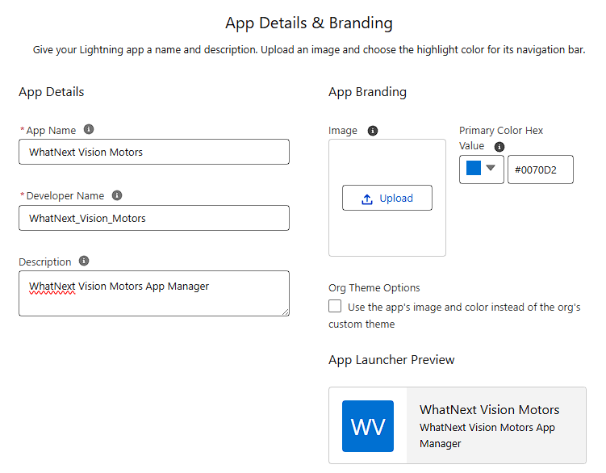
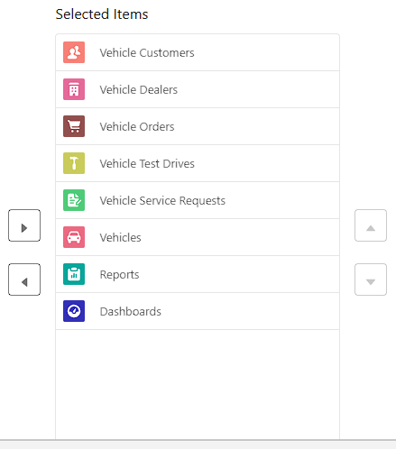
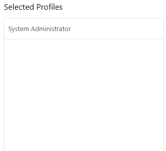

# Data Management-App Manager

1. Go To **App Manager** from Setup Home Quick Find
2. Click **Create New Lightning App**
3. Fill As Below
  
4. **Next**
5. **Next**
6. **Next**
7. Move Vehicles data from **Available Items** to **Selected Items** as shown below
  
8. Select **System Administrator** as User Profile
  
9. Click **Save**
10. Open **WhatNext Vision Motors** from **App Launcher** menu
