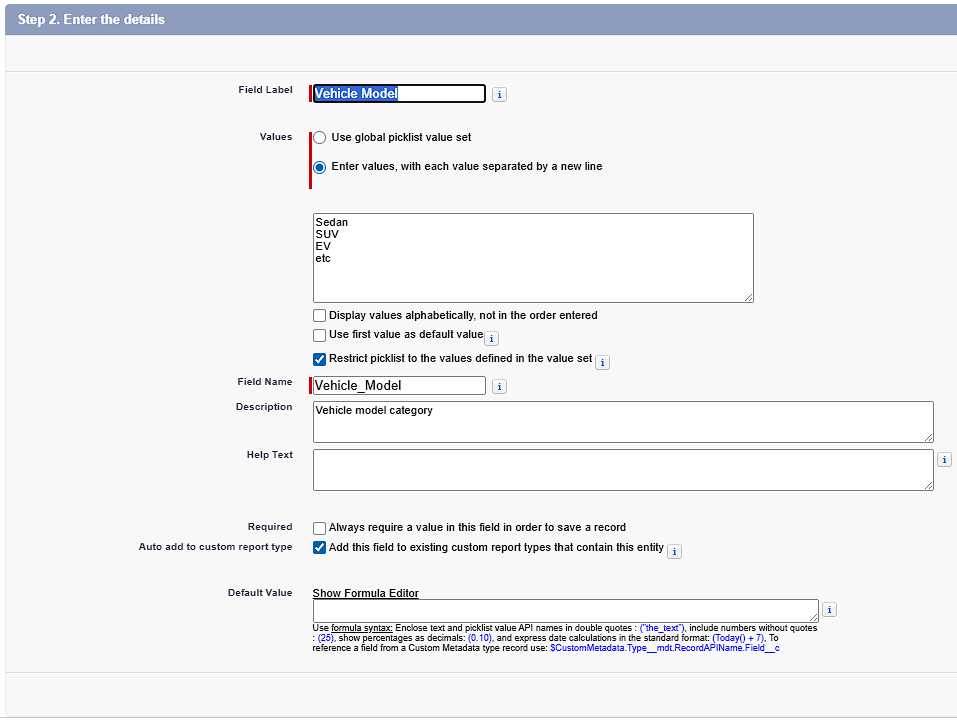
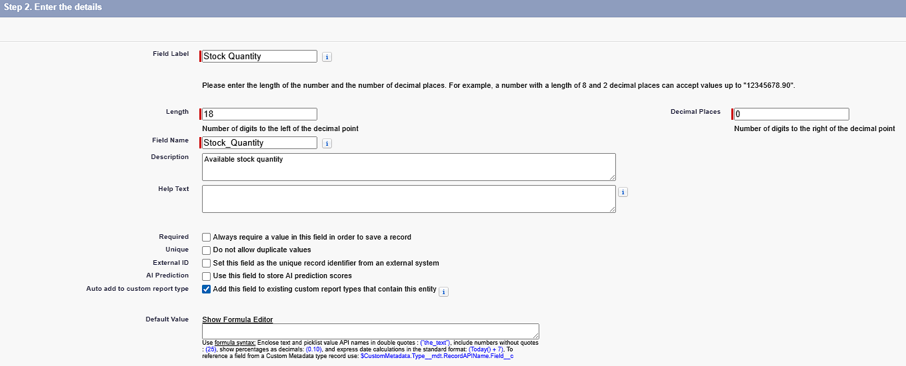
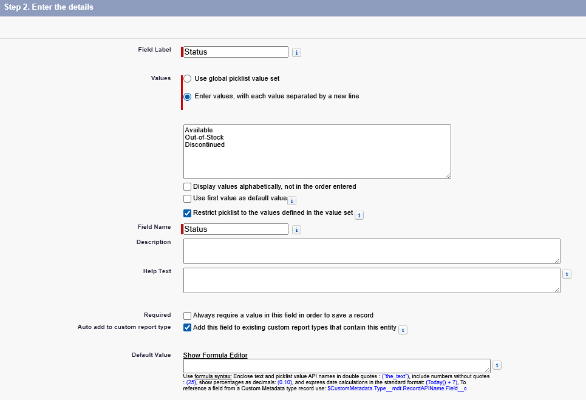
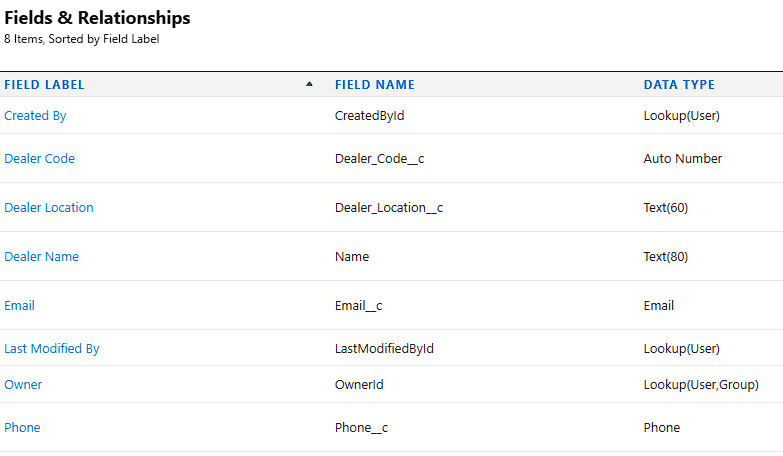
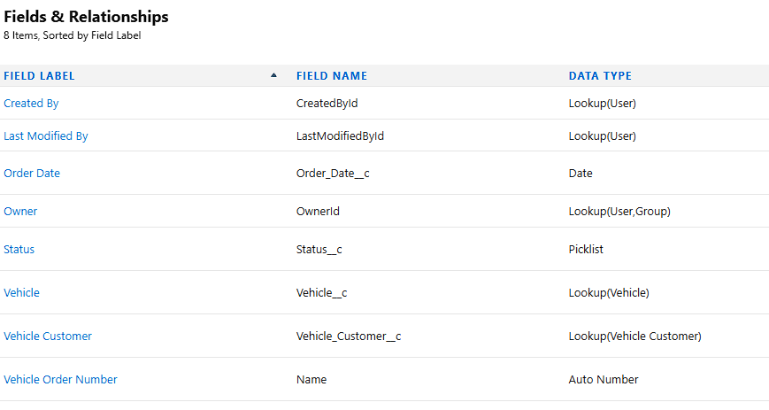
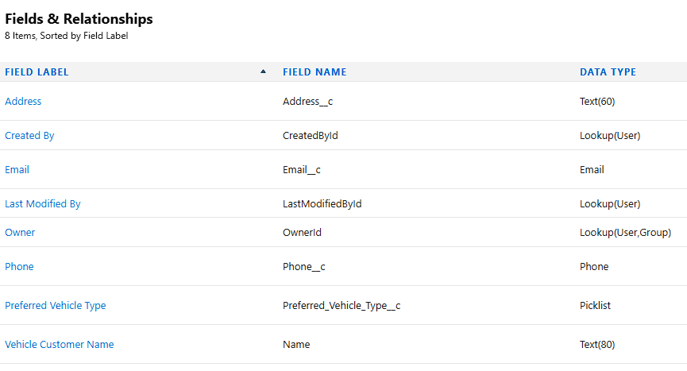
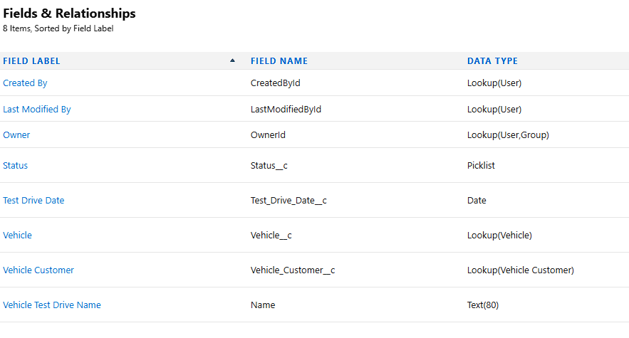
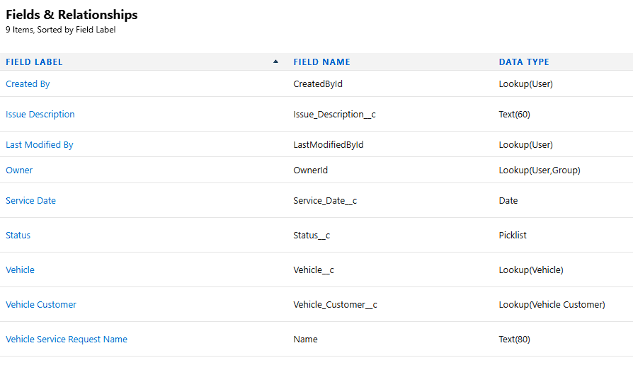

# Data Management Fields

## Creating a Field in Vehicle Object

| Field Name        | Field Type                                                 | Description / Relation              |
|-------------------|--------------------------------------------------          |-------------------------------------|
| Vehicle Name      | Text                                                       | Vehicle name                        |
| Vehicle Model     | Picklist (Sedan, SUV, EV, etc.)                            | Vehicle model category              |
| Stock Quantity    | Number                                                     | Available stock quantity            |
| Price             | Currency                                                   | Vehicle price                       |
| Dealer            | Lookup (to Vehicle Dealer)                                 | Related dealer                      |
| Status            | Picklist (Available, Out of Stock, Discontinued)           | Vehicle availability status         |

> **Vehicle Name** already created from object creation before

> **Next - Next - Save & New**

> **Next - Next - Save & New**

> **Next - Next - Save & New**

> Lookup Relation to Vehicle Dealer, **Next - Save & New**

## Creating a Field in Vehicle Dealer Object

| Field Name        | Field Type    | Description / Relation | Note                                               |  
|-------------------|---------------|------------------------|  -                                                 |
| Dealer Name       | Text          | Dealer name            |                                                    |
| Dealer Location   | Text(60)          | Dealer location        | Length = 60                                        |
| Dealer Code       | Auto Number   | Unique dealer code     | Display Format = DC-{0000}, Starting Number = 001  |
| Phone             | Phone         | Dealer phone number    |                                                    |
| Email             | Email         | Dealer email address   |                                                    |

## Creating a Field in Vehicle Order Object

| Field Name   | Field Type                                   | Description / Relation              |
|--------------|-----------------------------------------------|-------------------------------------|
| Customer     | Lookup (Vehicle Customer)                             | Related customer                    |
| Vehicle      | Lookup (Vehicle)                              | Related vehicle                     |
| Order Date   | Date                                          | Date of order                       |
| Status       | Picklist (Pending, Confirmed, Delivered, Canceled) | Order status                  |

## Creating a Field in Vehicle Customer Object

| Field Name                | Field Type                               | Description / Relation              |
|---------------------------|------------------------------------------|-------------------------------------|
| Customer Name             | Text                                     | Customer full name                  |
| Email                     | Email                                    | Customer email address              |
| Phone                     | Phone                                    | Customer phone number               |
| Address                   | Text(60)                                     | Customer address                    |
| Preferred Vehicle Type    | Picklist (Sedan, SUV, EV, etc.)          | Preferred vehicle category          |

## Creating a Field in Vehicle Test Drive Object

| Field Name        | Field Type                                   | Description / Relation              |
|-------------------|-----------------------------------------------|-------------------------------------|
| Customer          | Lookup (Vehicle Customer)                             | Related customer                    |
| Vehicle           | Lookup (Vehicle)                              | Related vehicle                     |
| Test Drive Date   | Date                                          | Scheduled test drive date           |
| Status            | Picklist (Scheduled, Completed, Canceled)    | Test drive status                   |

## Creating a Field in Vehicle Service Request Object

| Field Name           | Field Type                                      | Description / Relation              |
|----------------------|--------------------------------------------------|-------------------------------------|
| Customer             | Lookup (Vehicle Customer)                                | Related customer                    |
| Vehicle              | Lookup (Vehicle)                                 | Related vehicle                     |
| Service Date         | Date                                             | Vehicle service date                |
| Issue Description    | Text(60)                                             | Description of service issue        |
| Status               | Picklist (Requested, In Progress, Completed)    | Service request status              |

