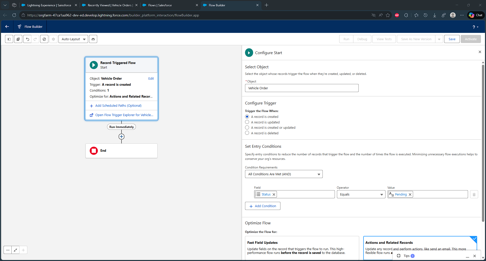
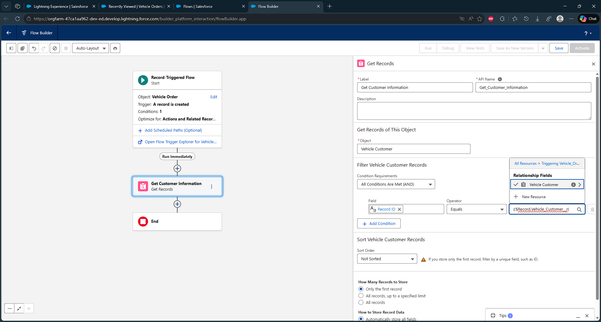
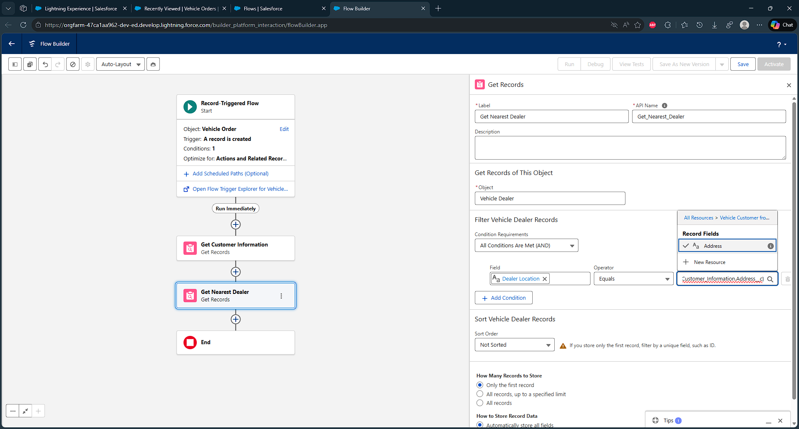
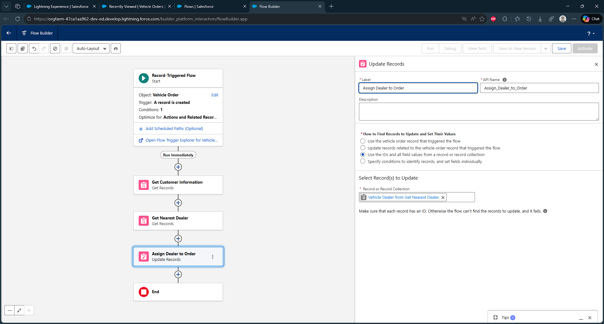
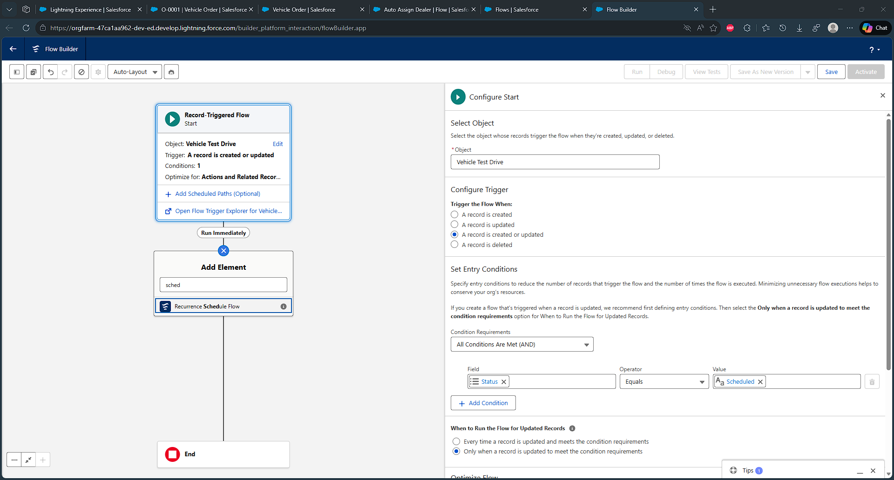
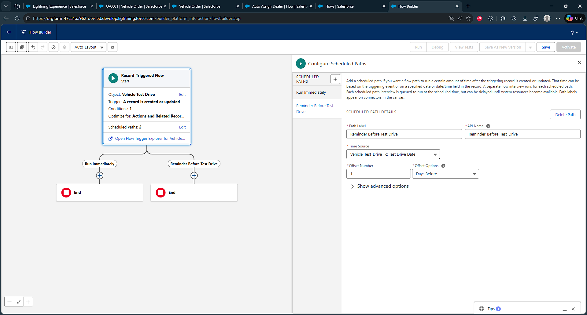
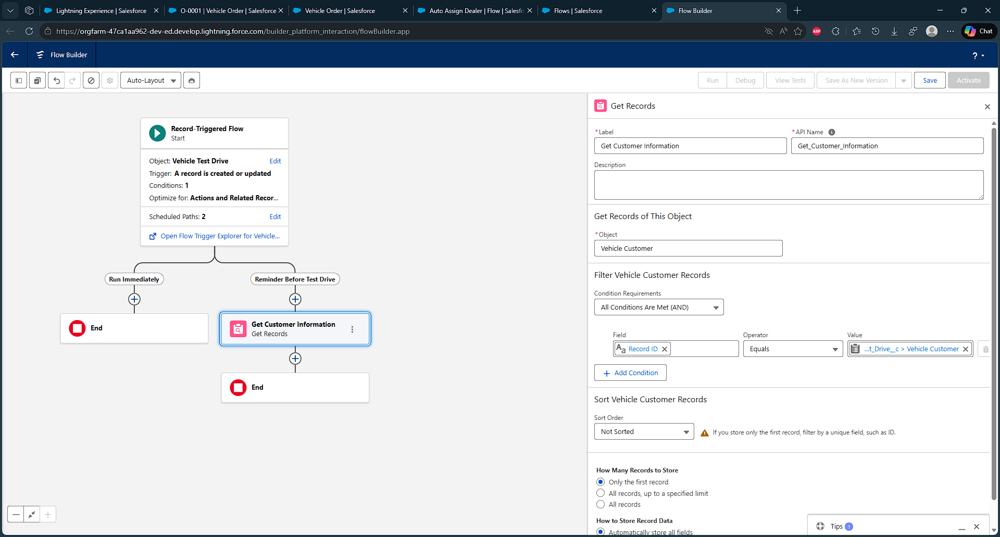

# Automation

## Flow Creation

1. Go to Object **Vehicle Order** 
2. Field and Relationship
3. New
4. Lookup Relationship > **Vehicle Dealer**
5. Give the name **Assigned Dealer**, save it

After creating the relation

1. Go to Quick Find, search **Flows**
2. Create new **Flow**
3. Select **Record Triggered Flow**
4. Now follow image
  
  
  
  

5. Click Save and Give label Name **Auto Assign Dealer**

## Record Trigger Flow Creation
Creating record triggered flow to send an email to the customer reminding about the test drive.

