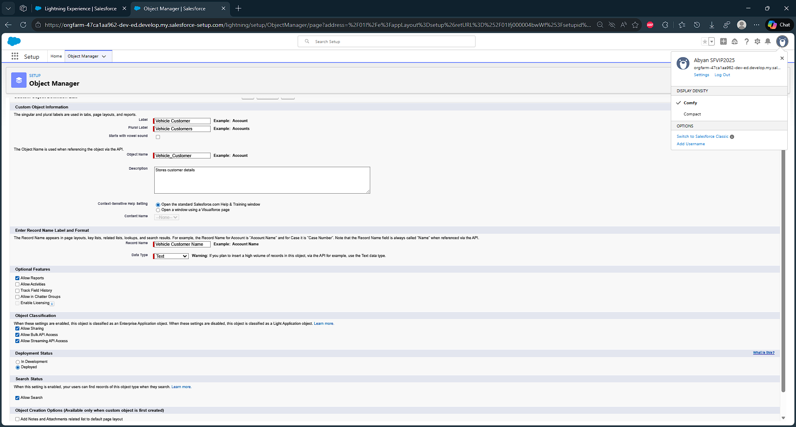
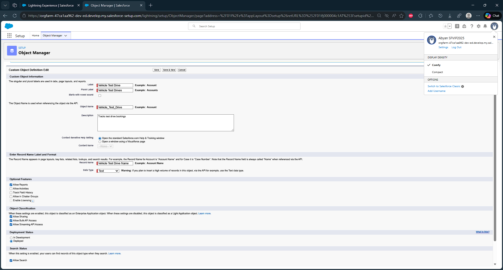

# Objects & Relationships

| Object Name                 | Purpose                              | Relationships                         |
|-----------------------------|--------------------------------------|---------------------------------------|
| Vehicle__c                  | Stores vehicle details               | Related to Dealer & Orders            |
| Vehicle_Dealer__c           | Stores authorized dealer info        | Related to Orders                     |
| Vehicle_Customer__c         | Stores customer details              | Related to Orders & Test Drives       |
| Vehicle_Order__c            | Tracks vehicle purchases             | Related to Customer & Vehicle         |
| Vehicle_Test_Drive__c       | Tracks test drive bookings           | Related to Customer & Vehicle         |
| Vehicle_Service_Request__c  | Tracks vehicle servicing requests    | Related to Customer & Vehicle         |

## Object Creation-Vehicle

| Context       | Value        |
| ------------- | ------------ |
| Label Name    | Vehicle      |
| Prural Name   | Vehicles     |
| Record Name   | Vehicle Name |
| Data Type     | Text         |
| Allow Reports | Yes          |
| Allow Search  | Yes          |

## Create Dealer Object

| Context       | Value           |
| ------------- | --------------- |
| Label Name    | Vehicle Dealer  |
| Prural Name   | Vehicle Dealers |
| Record Name   | Dealer Name     |
| Data Type     | Text            |
| Allow Reports | Yes             |
| Allow Search  | Yes             |

## More Object Creation

| Context       | Value                 |
| ------------- | ---------------       |
| Label Name    | Vehicle Customer      |
| Prural Name   | Vehicle Customers     |
| Record Name   | Vehicle Customer Name |
| Data Type     | Text                  |
| Allow Reports | Yes                   |
| Allow Search  | Yes                   |

| Context       | Value                |
| ------------- | ---------------      |
| Label Name    | Vehicle Order        |
| Prural Name   | Vehicle Orders       |
| Record Name   | Vehicle Order Number |
| Data Type     | Auto Number          |
| Display Format| O-{0000}             |
| Starting Num  | 001                  | 
| Allow Reports | Yes                  |
| Allow Search  | Yes                  |

| Context       | Value                   |
| ------------- | ---------------         |
| Label Name    | Vehicle Test Drive      |
| Prural Name   | Vehicle Test Drives     |
| Record Name   | Vehicle Test Drive Name |
| Data Type     | Text                    |
| Allow Reports | Yes                     |
| Allow Search  | Yes                     |

| Context       | Value                         |
| ------------- | ---------------               |
| Label Name    | Vehicle Service Request       |
| Prural Name   | Vehicle Service Requests      |
| Record Name   | Vehicle Service Request Name  |
| Data Type     | Text                          |
| Allow Reports | Yes                           |
| Allow Search  | Yes                           |

